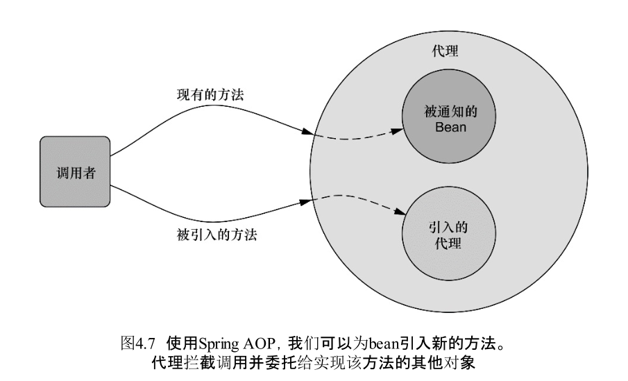

通过注解引入新功能

当引入接口的方法被调用时，代理会把此调用委托给实现了新接口的某个其他对象。实际上，一个bean的实现被拆分到了多个类中。

 

通过@DeclareParents注解，将Encoreable接口引入到Performance bean中。  
@DeclareParents注解由三部分组成：  
1. value属性指定了哪种类型的bean要引入该接口。在本例中，也就是所有实现Performance的类型。（标记符后面的加号表示是Performance的所有子类型，而不是Performance本身。）
2. defaultImpl属性指定了为引入功能提供实现的类。在这里，我们指定的是DefaultEncoreable提供实现。
3. @DeclareParents注解所标注的静态属性指明了要引入了接口。在这里，我们所引入的是AdvertisementAble接口。